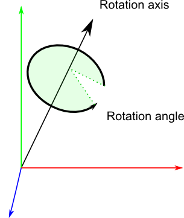
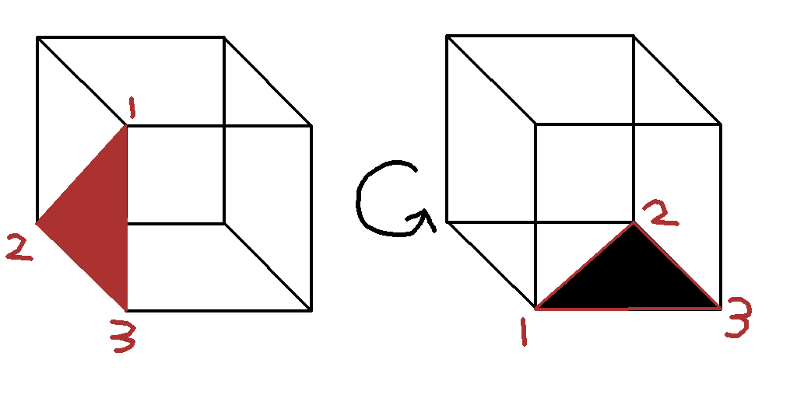

# Rotations and Quaternions

Note: This topic was hard and confusing as **** to understand. 

## Representing rotation/orientation

An objects rotation and/or orientation can be represented in either **Euler Angles** or **Quaternions** (there's more but these are the common approach). 

### Euler Angles 

Euler Angles are the easiest approach to understand, the orientation are represented by storing the 3 rotations around the X, Y, and Z axes. 

- `vec3 EulerAngle(α, β, γ)`
  - α - rotation around the x axis
  - β - rotation around the y axis
  - γ - rotation around the z axis

The rotations are then applied successively to retrieve the target orientation. Note that a different order results in a different orientation.

Common to use for FPS, just need X for up/donw, Y for heading (and maybe Z for tilt?)

Not to be confused with Tait-Bryan Angles. EulerAngles is not the same as Tait-Bryan Angles. Where Euler angles use the object's local axis on successive rotations, Tait-Bryan use the world axis on succesive rotations ( is this right? )

Notes:
- Working with two Euler Angles are hard, the results are not pretty :(
- Gimbal lock is an issue when using euler angles
  - when 2 axes align and one degree of freedom is lost
- Hard to represent rotation around a specific axis

### Quaternions

Quaternions are a set of 4 numbers (x, y, z, w) that represent the orientation with:
- `x = RotationAxis.x * sin(RotationAngle / 2)`
- `y = RotationAxis.y * sin(RotationAngle / 2)`
- `z = RotationAxis.z * sin(RotationAngle / 2)`
- `w = cos(RotationAngle / 2)`
- RotationAxis as the axis where the rotation is made
- RotationAngle as rotation along the rotation axis

#### Manipulation

- The quaternion vector is the same as the rotation axis
- Applying quaternion rotations to another quaternions is as simple as multiplication.
  - `quat combinedRot = secondRotation * firstRotation`
- Applying rotation to a point (with center as origin)
  - `rotatedPoint = quaternion * point`
- Applying rotation to a point (with given pivot point)
  - `rotatedPoint = pivotPoint + (quaternion * (point - pivotPoint))`
- Interpolation between quaternions (SLERP - Spherical Linear Interpolation)
  - `quat interpolatedQuat = glm::mix(quat1, quat2, factor)`

Notes:
- Unlike euler angles, quaternion does not suffer from gimbal locks
- Using quaternions is preferred for programming (faster than euler)

References: [LearnOpenGL](http://www.opengl-tutorial.org/intermediate-tutorials/tutorial-17-quaternions/#euler-angles)

## Applying rotations using quaternions

- For rotating using the object's local axis: `newOrient = oldOrient * rotation`
  1. Take the input rotation as quaternion
  2. And multiply it to the object's quaternion

- For rotating using the world's axis: `newOrient = rotation * oldOrient`.
  - `newOrient = oldOrient * (inverse(oldOrient) * rotation) * oldOrient`
    1. Take the input rotation as quaternion
    2. Multiple the inverse of orientation to quaternion (brings world rotation to local space)
    3. Apply this rotation to object

# Face culling

Face culling is an optimization that determines whether a polygon is drawn or not. Back-face culling is usually used where back-facing polygons are not rendered.

In OpenGL culling mode can be either GL_FRONT, GL_BACK or GL_FRONT_AND_BACK. In GL_FRONT_AND_BACK, no faces are drawn but lines and points are still drawn

## Winding order

Winding order is used in order to identify which polygons are front-face and which are not. By default, the winding order are:
- Front-facing polygons have counter-clockwise winding order (left-side in image below)
- Back-facing polygons have clockwise winding order (right-side in image below)

References: [LearnOpenGL](https://learnopengl.com/Advanced-OpenGL/Face-culling)

# OpenGL

## Coordinate System

OpenGL is a right-handed system. Which means that X-axis is to the right, Y-axis is up, Z-axis is backwards. 
Using the right hand rule for (Y x Z = X):
- point your index finger up (y-axis)
- point your middle finger to yourself (z-axis)
- then your thumb should point to the x-axis

Cross-product:
- X x Y = Z
- Y x Z = X
- Z x X = Y

Reference: [LearnOpenGL](https://learnopengl.com/Getting-Started/Coordinate-Systems)