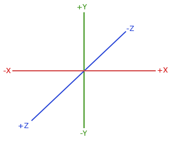

# OpenGL

## Coordinate System

OpenGL is a right-handed system. Which means that X-axis is to the right, Y-axis is up, Z-axis is backwards. 
Using the right hand rule for (Y x Z = X):
- point your index finger up (y-axis)
- point your middle finger to yourself (z-axis)
- then your thumb should point to the x-axis

Cross-product:
- X x Y = Z
- Y x Z = X
- Z x X = Y

Reference: [LearnOpenGL](https://learnopengl.com/Getting-Started/Coordinate-Systems)